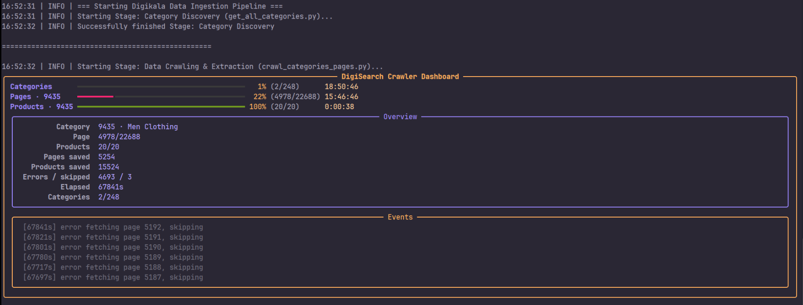

<p align="center">
  <a href="" rel="noopener">
 </a>
</p>


**Digisearch** is a Python CLI pipeline for discovering [Digikala](https://www.digikala.com/) categories and crawling product data into structured local files.

---

## ✨ Features

- **Category filtering** – include or exclude categories by keyword (case‑insensitive, partial matches on category `code`).
- **Category product crawl** — crawls product listing pages for each category. Note that the target website imposes a limit of 500 pages per category (approximately 10,000 products), which is the maximum reachable amount permitted by the site's structure. For every discovered product, it fetches:
  - Product metadata (JSON)
  - All reachable pages of product reviews (comments)
  - All reachable pages of product questions and answers

- **Resumable checkpoints** – if interrupted, the crawler resumes from the last processed category and page.
- **Live dashboard** – a  real‑time view of progress (categories, pages, products, errors) using `rich`.
- **Structured logs** – detailed logging to `logs/pipeline.log` and `logs/crawler.log` for debugging.
- **Packaged as a CLI tool** – install once, run `digisearch` from anywhere.


**Note**: Currently, the CLI handles data extraction. Search functionalities will be exposed in the next major update.

---

## 📦 Requirements

- Python 3.9+
- Internet connection (to access Digikala APIs)
- Disk space for the crawled data (expect several GB for large categories)

Dependencies are listed in `pyproject.toml` and `requirements.txt` – they will be installed automatically when you install the package.

---

## 🚀 Installation

### Option 1 – Install from source (recommended)


```bash
git clone https://github.com/artahaam/digisearch.git
cd digisearch
pip install .
```
then run:
```bash
digisearch --filters "men,clothes" --ignore "gold,silver" --output "men.csv"
```
### Option 2 – Manual (without installation)

```bash
git clone https://github.com/artahaam/digisearch.git
cd digisearch
pip install -r requirements.txt
```
then run
```bash
python run_pipeline.py --filters "men,clothes" --ignore "gold,silver" --output "men.csv""
```
---

## 🛠 Usage

The pipeline consists of two stages:

1. **Category Discovery** – `get_categories.py` fetches the entire category tree from Digikala, filters it, and writes a CSV file of category IDs.
2. **Crawling** – `crawl.py` reads that CSV and downloads all products, reviews, and Q&As for each listed category.

You control the whole process with a single command:
```bash
digisearch [--filters FILTERS] [--ignore IGNORES] [--output OUTPUT]
```
### Command‑line arguments

| Argument    | Type   | Default        | Description                                                                 |
|-------------|--------|----------------|-----------------------------------------------------------------------------|
| `--filters` | string | (empty)        | Comma‑separated keywords to **include**. Only categories whose `code` contains any keyword are kept. Example: `--filters "men,jeans"` |
| `--ignore` | string | (empty)        | Comma‑separated keywords to **exclude**. If a category’s `code` contains any ignored keyword, it is skipped`--filters`). |
| `--output`  | string | `categories.csv` | Name of the CSV file that stores the filtered categories. This file is later used as input for the crawler. |

> **Note**: All filters are case‑insensitive and match against the `code` field (e.g., `clothing-men`).  
> If neither `--filters` nor `--ignore` is given, **all** categories are crawled.

---

## 📂 Output structure

After a successful run, your project directory will contain:

```
digisearch/
├── data/
│   ├── raw/
│   │   └── category/
│   │       └── <category_id>/
│   │           ├── page/
│   │           │   └── page_1.json, page_2.json, ...
│   │           └── product/
│   │               └── <product_id>/
│   │                   ├── details.json
│   │                   ├── comments.json
│   │                   └── questions.json
│   └── checkpoints/
│       └── checkpoint.csv          # resume point (category id + page)
├── logs/
│   ├── pipeline.log                # overall pipeline logs
│   └── crawler.log                 # detailed crawler logs
├── <output>.csv                    # filtered category list (e.g., men.csv)
└── ...
```
- `page_*.json` – raw API response for each product‑listing page.
- `details.json` – full product information.
- `comments.json` – all user reviews for that product.
- `questions.json` – all customer Q&A entries.

---

## 🎛 Live Dashboard

While crawling, a **Rich** dashboard updates in real time:

<p align="center">
  <a href="" rel="noopener">
 </a>
</p>


Press `Ctrl+C` at any time to interrupt the crawl – it will resume from the last checkpoint on the next run.

---

## 🔄 Resuming a Crawl

If the pipeline stops (due to interruption, network error, etc.), simply run the **same command** again.  
The crawler reads the checkpoint file and continues from the last saved category and page number.  
No data is duplicated; checkpoints are written after every page.

---

## 🧪 Example

Fetch all categories containing `"clothes"` or `"men"`, but ignore those with `"gold"` or `"accessories"`, and name the output `my_categories.csv`:

```
digisearch --filters "clothes,men" --ignore "gold,accessories" --output "my_categories.csv"
```
To crawl **all** categories (no filtering):

```
digisearch --output "all_categories.csv"
```
---

## 🧰 Development

### Running the pipeline in parts

If you prefer to run stages separately:


#### 1. Generate the filtered category list
```
python get_categories.py --filters "men" --output "men.csv"
```
####  2. Crawl the categories (uses the CSV as input)
```
python crawl.py --output "men.csv"
```
### Logging

- Pipeline logs (stage start/end, arguments) → `logs/pipeline.log`
- Detailed crawler logs (per‑page, per‑product) → `logs/crawler.log`

---

## Roadmap

### Phase 1: Data Pipeline (Complete ✅)
- [x] Category discovery and filtering.
- [x] Product Details, Reviews and Q&As extraction.
- [x] Resumable checkpoints.

### Phase 2: Data Cleaning and Dataset Preparation
- [ ] To be planned
---

## 📄 License

MIT – see [LICENSE](LICENSE) file.

---

## 🤝 Contributing

Pull requests are welcome. For major changes, please open an issue first to discuss what you would like to change.


---

## 📬 Contact

**Author**: artahaam  
**Email**: alireza.thm03@gmail.com  
**GitHub**: [@artaham](https://github.com/artahaam)
